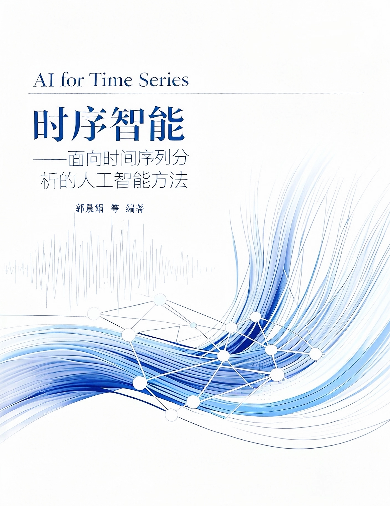

# **<p align="center">时序智能——面向时间序列分析的人工智能方法 </p>**

<div align=center>

</div>

本书面向对**时间序列分析**与**人工智能**感兴趣的读者，旨在系统梳理相关基础知识，深入讲解从传统统计建模到前沿深度学习方法的关键技术与实际应用。作者团队将持续关注开源社区及学术前沿，认真采纳专家学者的意见与建议，并计划定期进行更新，力求打造一本兼具可读性、实用性与学术研究价值的时序智能专著。

本书内容包括**介绍、基础概念、时间序列预测、时间序列异常检测、时间序列分类、自动化时间序列分析、时间序列基础模型、时间序列评测基准、神经微分方程时间序列分析**等九部分。每章内容均基于作者团队在相关方向的探索与实践整理而成，仅代表作者团队的理解，如有疏漏或错误，诚恳欢迎读者提出宝贵意见。未来，团队将继续拓展更多前沿方法、实用工具及评测标准，并逐步完善专著内容。

当前本书完整的PDF下载路径：[时序智能.pdf](https://github.com/decisionintelligence/AI4TS/tree/main/Book)。其他下载路径：[Google Drive](https://drive.google.com/file/d/1nw_Cjv15QJAg6o_vxhKhnddHxA6rashY/view?usp=sharing)，[百度网盘](https://pan.baidu.com/s/1hcZ9oBYQF9Rc5pQH_NbenA?pwd=k9ub)。其中每个章节的内容目录如下所示。

## **章节结构**


## **关于作者**

### **主编**

[**郭晨娟**](https://faculty.ecnu.edu.cn/_s37/gcj/main.psp) 华东师范大学 数据科学与工程学院 教授 博士生导师 国家级青年人才 上海市领军人才

### **副主编**

[**杨彬**](https://binyangdk.github.io/) 华东师范大学 数据科学与工程学院 二级教授 博士生导师 国家级领军人才             

[**胡吉林**](https://hujilin1229.github.io/) 华东师范大学 数据科学与工程学院 教授 博士生导师 国家级青年人才

[**树扬**](https://shuyang96.github.io/) 华东师范大学 数据科学与工程学院 助理教授 硕士生导师 晨晖学者


### **核心编写组**

该书编写工作由[<b>华东师范大学决策智能实验室(Decision Intelligence Lab)</b>](https://decisionintelligence.github.io/index)成员共同参与完成，负责专著的章节编写、案例设计、实验验证与配套资源开发。

参与成员如下（按照姓名音序排列）：

陈鹏、陈宇轩、成涵吟、丁逸飞、高洪帆、胡诗彦、黄姗姗、金建新、雷智、李北步、李哲、李正宇、陆骏凯、<br>卢雨凝、邱翔飞、邱钰莹、申屠琦超、田锦东、王益杭、汪琳丰、汪思远、吴行健、严思雨、徐榕荟、张睿桐、<br>郑兴泽


## **致谢**

本书的不断优化完善，离不开每一位读者的关注与支持。

我们真诚欢迎大家积极提出建议与问题，您的反馈将帮助我们不断改进内容、提升质量。

对于所有贡献意见的读者，我们将表示由衷的感谢。

公众号：DI DaSE ECNU


### License

本专著项目包含两部分内容，授权方式如下：

- **教材文字与图像内容**：使用 [CC BY-NC-ND 4.0 国际许可协议](https://creativecommons.org/licenses/by-nc-nd/4.0/) 授权。  允许非商业性转载与分享，但禁止修改或衍生使用。  

- **示例代码**：使用 [MIT License](https://opensource.org/licenses/MIT) 授权。  可自由使用、修改与分发，请保留署名信息。


### 引用本书

如果您在研究或教学中引用本文，请按以下格式引用：

```
@misc{guo2025ai4ts,
  author       = {郭晨娟 and 杨彬 and 胡吉林 and 树扬等},
  title        = {时序智能——面向时间序列分析的人工智能方法},
  year         = {2025},
  url          = {https://github.com/decisionintelligence/AI4TS},
  note         = {文字与图像内容：CC BY-NC-ND 4.0. 示例代码：MIT License. Version 1.0.}
}
```
